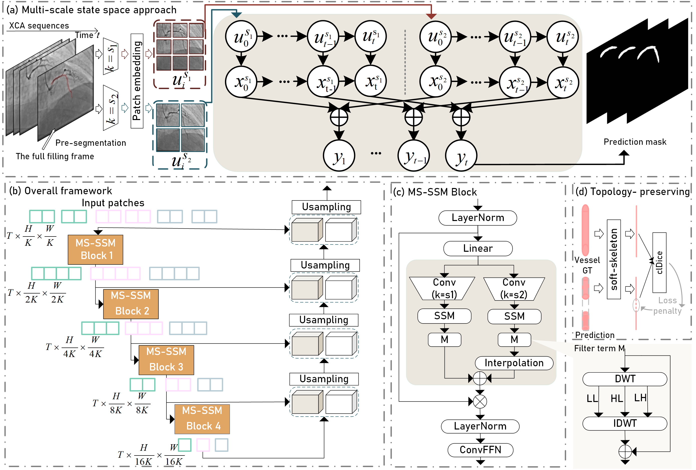
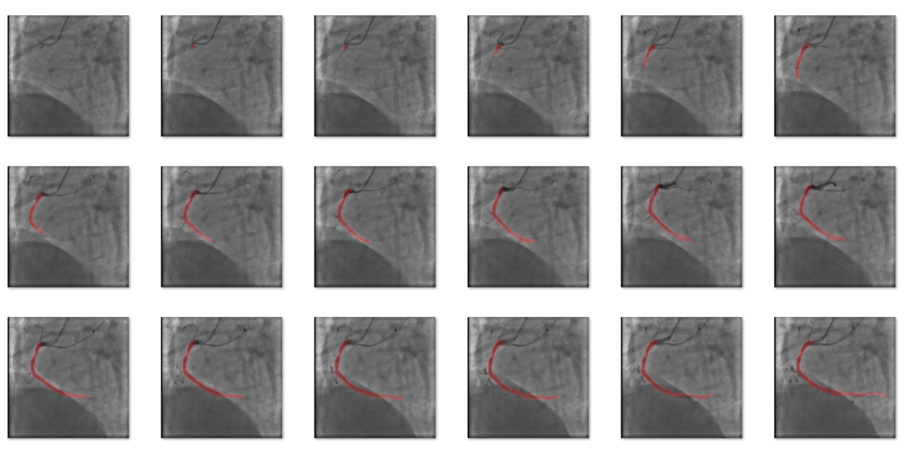

# Temporally Consistent Segmentation of Main Coronary Artery in X-ray Coronary Angiography Sequences

# overview

This code is for the paper: Temporally Consistent Segmentation of Main Coronary Artery in X-ray Coronary Angiography Sequences.
The experimental data consists of coronary angiography video sequences of the heart. The data example is presented as follows:

# Quick start
We provide the code for our model here (Immediately fully publicly available after the paper is accepted). The specific model settings can be found in the article's documentation.
Before training the model, please configure the dependencies in the `requirements.txt`. 

# Citation
If you use our method or any part of it in your research, please cite this artical.
